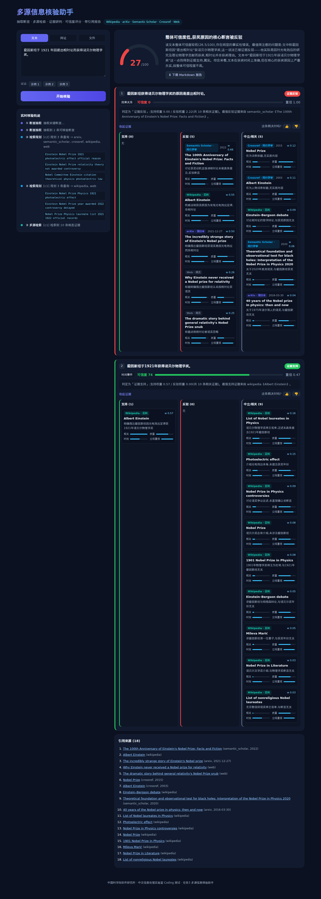

# 多源信息核验助手 (Multi-source Information Verification Assistant)

> 中国科学院软件研究所 · 中文信息处理实验室 Coding 测试 — **任务3**

输入一段**说法 / 段落 / 报告**,系统自动:**抽取关键断言 → 多源检索证据 → 评估证据质量·时效·相关性 → 给出可解释的断言级裁决与 0–100 可信度评分 → 生成带引用的核验报告**,并通过 SSE 实时展示核验轨迹。



---

## ✨ 功能

- **断言抽取**:把文本拆成原子化、自包含(已消解指代)的可核验断言,并标注类型与可核验性。
- **多源证据检索**(均无需 API key):**Wikipedia · arXiv · Semantic Scholar · Crossref · DuckDuckGo Web**,按断言类型智能路由。
- **证据评估**:LLM 判立场/相关性 ⊕ 确定性代码算来源质量/时效 → 综合权重(可审计)。
- **断言级可信度评分**:`方向 × 强度` 公式,五档裁决(支持/反驳/部分支持/**证据冲突**/证据不足)。
- **可解释 + 带引用报告**:逐条说明 + 编号引用来源,支持 Markdown 导出。
- **证据冲突可视化**:每条断言的支持/反驳/中立证据三栏对照。
- **多输入格式**:文本 / URL(抓正文)/ 文件(.txt/.md)。
- **实时核验轨迹**:SSE 流式推送六阶段进度(Agent 执行轨迹)。
- **反馈闭环**:对每条裁决 👍/👎,为后续策略优化留接口。

---

## 🚀 快速开始

系统依赖 Anthropic 模型,运行前需提供环境变量:

```bash
export ANTHROPIC_API_KEY=sk-...            # 必需
export ANTHROPIC_BASE_URL=https://api.anthropic.com   # 可选(默认官方)
export ANTHROPIC_MODEL=claude-opus-4-8      # 可选
```

### 方案一:一键脚本(本地)

```bash
./run.sh
# 打开 http://localhost:8000
```
脚本自动建虚拟环境、装依赖、(必要时)构建前端并启动。仓库已附带 `frontend/dist/`,**无 Node 也能跑**。

### 方案二:Docker 一键运行

```bash
docker compose up --build
# 打开 http://localhost:8000
```

### 命令行(无需前端)

```bash
cd backend && . .venv/bin/activate
python cli.py "爱因斯坦于1921年因相对论获得诺贝尔物理学奖。"
```

---

## 🧩 技术栈

- **后端**:Python 3.12+ / FastAPI / httpx(全异步)/ SSE 流式
- **前端**:React 18 + Vite + TypeScript(手写 CSS,无重型 UI 框架)
- **模型**:Anthropic Claude(结构化工具调用强制 JSON Schema 输出)

---

## 📡 API

| 方法 | 路径 | 说明 |
|---|---|---|
| POST | `/api/verify` | 起核验任务,接受 JSON `{text\|url}` 或 multipart `file`,返回 `job_id` |
| GET | `/api/stream/{job_id}` | SSE 流式推送六阶段事件,最后一帧为完整报告 |
| GET | `/api/report/{job_id}` | 完成后的报告 JSON |
| GET | `/api/report/{job_id}.md` | 下载 Markdown 报告 |
| POST | `/api/feedback` | 提交对某条裁决的反馈 |
| GET | `/api/health` | 健康检查 |

---

## 📂 目录结构

```
backend/    FastAPI 后端 + 六阶段核验流水线 + 可插拔证据源
frontend/   React 前端(含已构建 dist/)
docs/       DESIGN.md 设计文档 · 截图 · 介绍 PPT(LaTeX/beamer)
trace/      开发过程的 Claude Code 完整交互轨迹
run.sh / Dockerfile / docker-compose.yml
```

详尽的设计思路、关键决策取舍与**真实迭代记录**见 [`docs/DESIGN.md`](docs/DESIGN.md)。
介绍 PPT(LaTeX 源码,含 TikZ 绘制的架构图/思维导图)见 [`docs/slides.tex`](docs/slides.tex)。

---

## ⚙️ 可调参数(环境变量)

| 变量 | 默认 | 含义 |
|---|---|---|
| `FACTCHECK_MAX_CLAIMS` | 8 | 最多核验断言数 |
| `FACTCHECK_QUERIES_PER_CLAIM` | 3 | 每条断言查询数 |
| `FACTCHECK_EVIDENCE_PER_QUERY` | 4 | 每条查询每源取证数 |
| `FACTCHECK_MAX_EVIDENCE` | 10 | 每条断言送研判的证据上限 |
| `FACTCHECK_CONCURRENCY` | 6 | 并发上限 |
